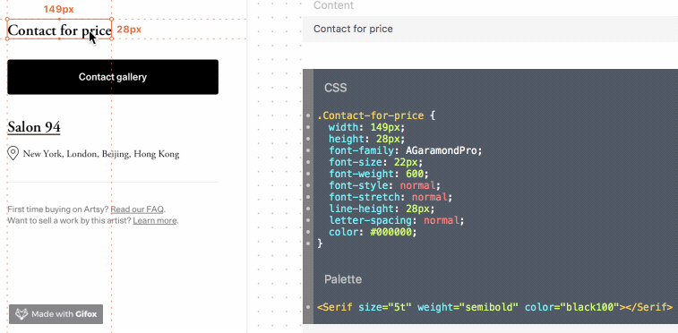

# Palette Zeplin Extension

This utility assists in rapid UI development by providing component snippets from the Palette project directly in Zeplin.

## Installation

Then in the Zeplin app, open the `Extensions > Manage Project Extensions` menu. In the extensions window, hold down the <kbd>alt</kbd> key and click the `Add Local Extension` button in the top-right corner. In the modal panel add the URL below. You're all set!

https://artsy.github.io/palette-zeplin-extension/manifest.json
